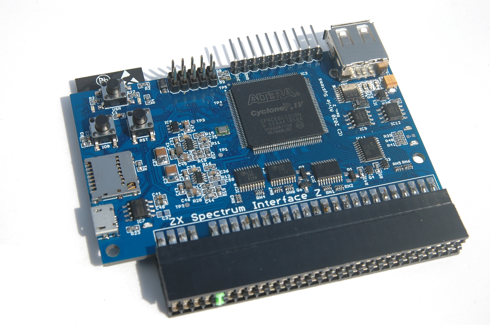
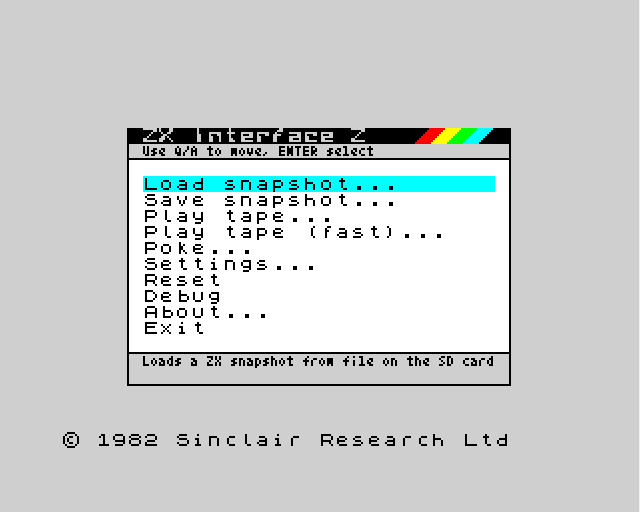
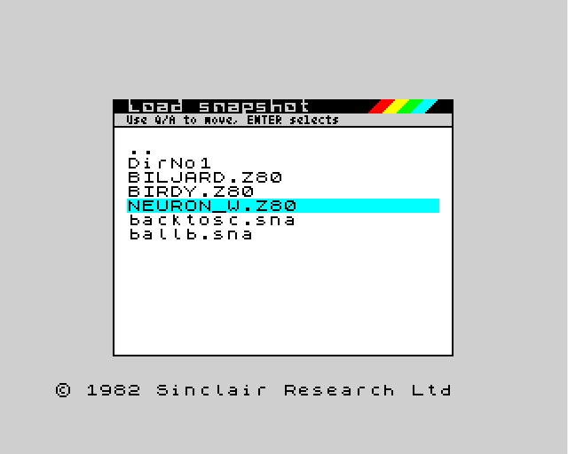
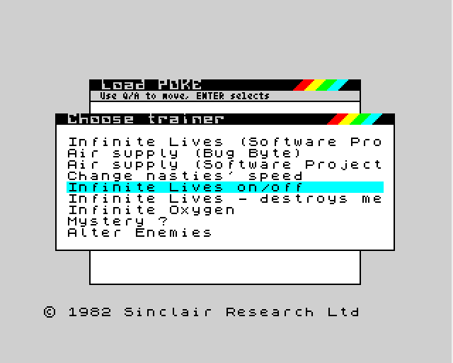
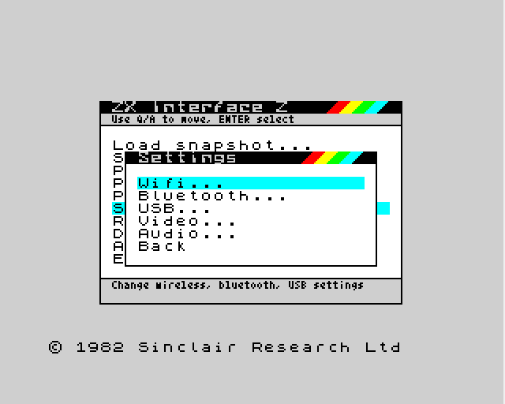

# What is ZX Interface Z?

The _ZX Interface Z_ is an expansion card for the ZX Spectrum which supports, among
other features:

- VGA and audio output via micro expansion card
- USB devices, such as keyboard, gamepads and memory sticks.
- Wifi
- Micro SD card
- Bluetooth [planned]
- YM2149 sound on all models

Internally, the _ZX Interface Z_ includes:

- A dual-core CPU with WiFi and Bluetooth radio
- An Intel FPGA                                
- 64MB of RAM, also accessible from the ZX Spectrum
- USB for debugging and programming

the _ZX Interface Z_ is __fully open source!__. The software, the board and the FPGA designs are
available online under open source licences so anyone can modify them or build
their own.

# Current version
The current hardware version is 2.4. This hardware is compatible with the
models described in this document.

# Where is the source?

All sources are available in github:

[https://github.com/alvieboy/ZXInterfaceZ](https://github.com/alvieboy/ZXInterfaceZ)

# Supported hardware
The following ZX Spectrum hardware is supported:

- ZX Spectrum 16K
- ZX Spectrum 48K
- ZX Spectrum 128K (gray)
- ZX Spectrum 128K (toastrack)
- ZX Spectrum +2A
- ZX Spectrum +3

Some features might not be available depending on the model. See section 
Hardware Limitations for details regarding support of your ZX Spectrum model.

# The board
The _ZX Interface Z_ board has the following features available for user
interaction and information:

- Two user buttons - USR and IO0
- 6 LEDs (one for power, 5 for information)
- One hard-reset button

The _ZX Interface Z_ also includes one expansion port which can hold other 
boards. The VGA and audio output plug into this expansion port.

The USR button is used to access the _ZX Interface Z_ main menu. The IO0 button
is configurable and can be used for different purposes.

By default, holding the IO0 button for more than one second loads a Diagnostics ROM
which you can use to diagnose your ZX Spectrum hardware.

# Main menu
The main menu is normally accessible by pressing shortly the USR button. Most of 
the _ZX Interface Z_ functionality is accessible using this menu.

From the main menu, you can:

- Load snapshots
- Save snapshots
- Play tapes
- Poke memory
- Change _ZX Interface Z_ settings
- Reset the ZX Spectrum
- Debug the ZX Spectrum [experimental]
- See information about the system

# Loading software
It is possible to load a multitude of software using the _ZX Interface Z_. Loading
of software is either done by restoring the ZX Spectrum state, or by using 
tapes.

Loading of software is possible from the following sources:

- microSD card
- USB flash drive 
- USB CDROM [planned]
- Network [planned]

## Loading tape files

The following tape files can be loaded using the _ZX Interface Z_:

- TAP tapes
- TZX tapes

See Tape Loading Methods for details on limitations of each file type and 
ZX Spectrum model.

## Loading snapshot files

Snapshot files can also be loaded by the _ZX Interface Z_. The following snapshot
files are supported:

- SNA [48K only, 128K planned]
- Z80 [experimental]

## Tape loading methods

There are two methods for loading tape files. Depending on the tape file and on
the platform it might or might not be possible to load them.

### ROM-hooked LOAD (FastTAP)
This method allows for quick loading of tapes and relies on ROM hooks to perform
loading. The following tapes are supported using this mode:

- Standard TAP and TZX tapes (not using custom loaders, like copy protection
loaders or fast loaders)

### Audio emulation loading
This method allows any tape to be loaded, but is not compatible with all ZX 
Spectrum models. The following tapes are supported using this mode:

- TAP and TZX tapes

See section Hardware Limitations for details regarding support of audio emulation
of your ZX Spectrum model.

# Saving software
It is possible to save software using the _ZX Interface Z_ by either capturing the
ZX Spectrum state (snapshot) or by saving to tape files.

Saving software is possible to the following devices:

- microSD card
- USB flash drive

## Snapshots
It is possible to save a snapshot of the ZX Spectrum to a file. Support for
snapshot might depend on the actual ZX Spectrum used. See section 
Hardware Limitations for details regarding support of snapshots for your 
ZX Spectrum model.

## Automatic load/save menu
The ZX Interface Z comes with a method of automatic load menu. This means whenever
you type in LOAD or SAVE commands in the ZX Spectrum BASIC, or if any program
enters the standard ROM LOAD or SAVE routines, a pop up will show which allows
you to select a TAPE file to load or save. It is possible to append to tape files
as well.

# Pokes
The  _ZX Interface Z_ supports pokes dynamically - all you have to do is to place
POK files in your microCD or USB memory stick and load them using the menu.
If any parameters are needed, the _ZX Interface Z_ will ask your for their
values.

# Quick snapshot
This feature is still in the planned stage.

It will be possible to map inputs to trigger a quick snapshot, which is quite
useful if you want to immediatly save what is going on in your ZX Spectrum, such
as a particular game you are playing.

See General input device support for more details.

# Audio support
The _ZX Interface Z_ supports audio output using a dedicated expansion card. This
is usually done by the VGA+Audio companion adaptor.

The _ZX Interface Z_ includes an YM2149 sound chip inside the main FPGA, which
can output audio to the Audio adaptor on the expansion port.

The audio output is stereo, and includes a mixer for the internal audio and the
YM2149 three-channel outputs. Each of these can be adjusted in volume and balance
between the left and right channels.

The audio configuration is persistent, it will be stored and restored next
time you power the _ZX Interface Z_.

# Video support

The _ZX Interface Z_ supports digital video output through the expansion port.
This is often done by plugging the VGA+Audio companion adaptor.

There are a set of different modes available for output, which can be configured
on the settings menu.

The video is generated by capturing the Z80 interaction with the video memory,
so even if your ZX Spectrum lower ram is malfunctioning, the video output will still
work as expected (so diagnostics ROM will work properly).

# General input device support
The _ZX Interface Z_ is very versatile in terms of input support, being it 
joysticks, gamepads, mice and keyboards. These connect through the USB port.

The behaviour of each input device (or, more specifically, each physical entity of
each device) can be mapped to a particular action. For example, it is possible
to configure certain USB keyboard keys to act as a mouse press, or to bring
up the main menu, or to perform a quick snapshot save. Also possible, for example,
is to map a joystick to keys, or a particular gamepad button to mute the audio output.

The following mappings are available for each physical input:

- Keyboard press+release
- Joystick axis movement or button
- Mouse movement or button
- Main Menu
- Quick save/load [planned]

# Wireless Support

The ZX Interface Z supports WiFi in one of two modes. It can act as a standard
WiFi client device (station) connected to a WiFi Access Point, or it can work
in standalone mode, where the ZX Interface Z is itself an Access Point where you
can connect to.

### WiFi modes
- 802.11b/g/n support

### WiFi authentication modes

- WPA2 
- Open (no authentication)

# Settings configuration
You can access the settings configuration on the main menu.

From the settings menu you can configure:

- WiFi 
- Bluetooth [planned]
- USB [experimental]
- Video output settings
- Audio settings

# Networking support
There is full networking support inside the main firmware. A subset of the
networking API is available to the ZX Spectrum via a separate API.

# Firmware upgrade
The ZX Interface Z firmware can be upgraded using one of the following methods:

- Micro USB cable using a dedicated tool
- Over-the-air upgrade [planned]
- Upgrade via USB flash drive [planned]

# The web page
The _ZX Interface Z_ includes a web site which you can use to perform several 
configuration and operations.

The web page is accessible by pointing your browser to http://interfacez.local/.

The web page is under active development, and will likely change heavily during
development phase.

# Hardware considerations

Take this information into account before using the _ZX Interface Z_:

- For all models, the USB port is powered by the ZX Spectrum 5V rail. This
limits the amount of current that can be drawn by the USB port without 
interfering with the ZX Spectrum or lead to overheat of the internal ZX
Spectrum regulator. __DO NOT CONNECT ANY USB DEVICE THAT DRAWS MORE THAN 200mA!!!__ 
This may lead to destruction of the ZX Spectrum regulator. The Interface Z team
cannot be liable for damage of the ZX Spectrum if such a device is connected.
For safety reasons, shorting the USB power lines will temporarly disable the USB port.

- For the ZX Spectrum models powered by +9V supply, the Interface Z power is
drawn directly from the +9V rail.

- For the ZX Spectrum models __not__ powered by +9V supply, the Interface Z power 
is drawn from the +12V rail.

# Hardware limitations
The following platforms might have limitations due to ZX Spectrum hardware design:

## ZX Spectrum 16K

No limitations

## ZX Spectrum 48K

No limitations

## ZX Spectrum 128K (gray)

Snapshots are only possible for 48K mode (128K support is planned)

## ZX Spectrum 128K (toastrack)

Audio emulation for tape loading is not supported

Snapshots are only possible for 48K mode (128K support is planned)

## ZX Spectrum +2A                                  

Audio emulation for tape loading is not supported.

Snapshots are only possible for 48K mode (128K support is planned)

## ZX Spectrum +3
Audio emulation for tape loading is not supported

Snapshots are only possible for 48K mode (128K support is planned)

## Other models
Other ZX Spectrum models, clones and TIMEX models are currenly unsupported.
