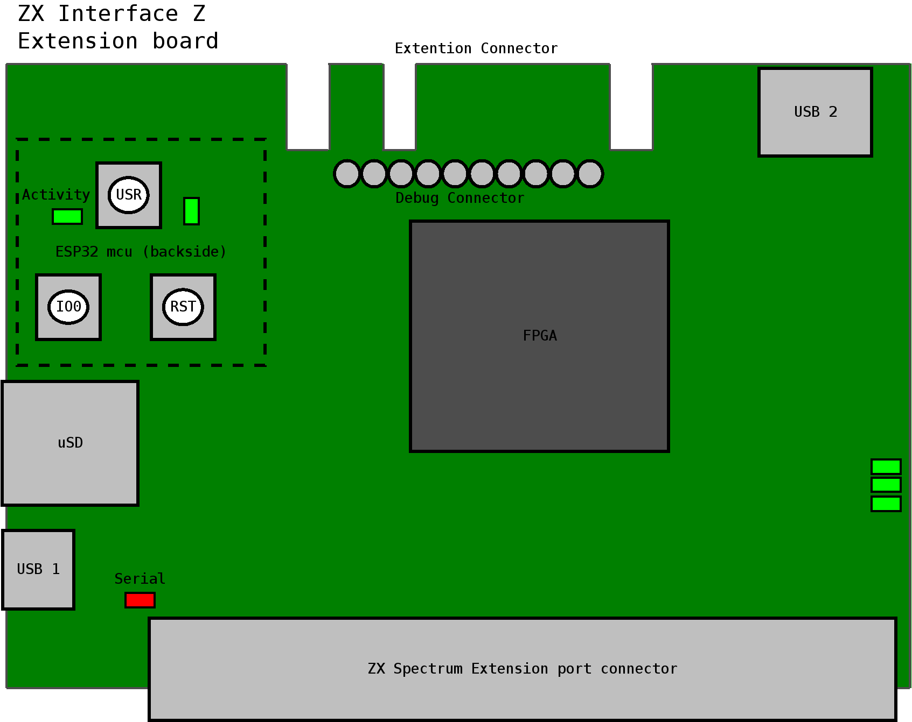

# ZX Interface Z

## Quick Start

- Turn off your ZX Spectrum
- Connect the _Interface Z_, ensure that it is firmly inserted into the expansion port.
- Power on your ZX Spectrum.
- Push the **USR** button to bring up the _ZX Interface Z main menu_.

# Using your ZX Interface Z

The Interface Z can be controlled through the _ZX Interface Z main menu_ which
is brought up by pushing the **USR** button or by accessing the _Web Interface_
if network has been set up.

## Board Layout



## Navigation

#### USB Joystick

Not implemented yet.

#### Keyboard

- `Q` - Up
- `A` - Down
- `ENTER` - Select
- `BREAK` - Back

## Video

Adjusting Video output

## Sound

## Load/Save Snapshot

## Fast Load Tape

- Trigger the _main menu_, and chose _Play tape (fast)..._ choose the TAP or TZX file.
- Type in `LOAD ""`
- Enjoy as if you were using a super fast tape.

## Play Tape

- Type in `LOAD ""`
- Trigger the _main menu_, and chose _Play tape..._ choose the TAP or TZX file.
- Enjoy as if you were using a real tape.

## Poke

# Web Interface

## Connecting to Wifi

Default is _SSID_ `ZXInterfaceZ`, _password_ `zxspectrum`, and IP `192.168.120.1`.

# Advance

## Serial Console

You can connect to the _ZX Interface Z_'s serial console by connecting a
USB-cable to the _micro USB_ port and connecting with a terminal program
at `115200` baud with `8N1`. The USB serial chip used is a _CH330_.

Example command to connect with `cu` on Linux:

```
cu -l /dev/ttyUSB0 -s 115200
```

Be sure to double check which device is the _ZX Interface Z_. It can be done
with `dmesg | grep ttyUSB`.

### Console Commands

TODO See [console.c](https://github.com/alvieboy/ZXInterfaceZ/blob/master/esp32/main/console.c#L168)

# Troubleshooting
